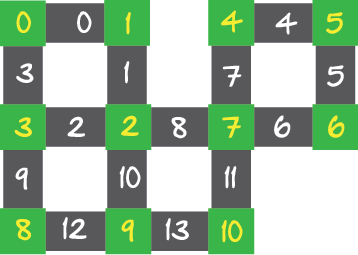

# Desafio PE

Joãozinho tem uma empresa especializada na segurança de condomínios. Um dos serviços que ele presta é a instalação de câmeras de segurança para vigiar as ruas dos condomínios. O sistema funciona conforme explicado abaixo.

Antes de prosseguir, convém notar que, nesta tarefa, iremos supor que cada rua é composta de uma única quadra e, portanto, contém exatamente duas esquinas. Além disso, supomos também que não existem ruas que sejam "becos sem saída" (ou seja, tenham só uma de suas extremidades que façam esquina com outras ruas).

Além disso, as câmeras usadas pela empresa possuem visão de `360` graus e um alcance que é suficiente para, estando uma câmera em uma das extremidades de uma rua, ela enxergará todo trecho da rua até a sua outra extremidade. Por razões econômicas, a equipe de funcionários de Joãozinho é instruída a só instalar câmeras nas esquinas das ruas.

Dadas estas características, note que uma câmera instalada em uma esquina consegue vigiar todas as ruas que chegam nesta esquina.

O objetivo desta tarefa é fazer um programa que, dado o mapa de ruas de um condomínio e um inteiro `K`, determina se é possível vigiar todas as ruas do condomínio usando exatamente `K` câmeras e, em caso afirmativo, indicar em quais esquinas elas devem ser instaladas.

Seja `N` o número de esquinas e `M` é o número de ruas do condomínio. Os índices que identificam as esquinas serão `0, ..., N-1`. Da mesma forma, os índices que identificam as ruas serão `0, ..., M-1`. O mapa do condomínio será representado por uma matriz `NxM` na qual o valor de cada célula será `0` ou `1`. Nesta representação `A[I][J] = 1` se e somente se `I` for uma das esquinas da rua `J` (note que, por definição, cada coluna terá exatamente dois valores iguais a `1` e os demais serão nulos).

Abaixo vê-se uma figura de um mapa de um condomínio onde a numeração das ruas encontra-se em branco e a das esquinas em amarelo. Então, neste mapa temos, por exemplo, a rua `1` cujas esquinas são `1` e `2`, a rua `11` cujas esquinas são `7` e `10` e assim por diante. Por outro lado, a esquina `7` é extremidade das ruas `6`, `7`, `8` e `11` (repare que, neste mapa em particular, uma esquina é extremidade de no máximo `4` ruas mas que isso não é uma restrição das entradas desta tarefa).



Para o mapa deste exemplo, `N = 11`, `M = 14` e a matriz correspondente é aquela mostrada a seguir.

```
1 0 0 1 0 0 0 0 0 0 0 0 0 0
1 1 0 0 0 0 0 0 0 0 0 0 0 0
0 1 1 0 0 0 0 0 1 0 1 0 0 0
0 0 1 1 0 0 0 0 0 1 0 0 0 0
0 0 0 0 1 0 0 1 0 0 0 0 0 0
0 0 0 0 1 1 0 0 0 0 0 0 0 0
0 0 0 0 0 1 1 0 0 0 0 0 0 0
0 0 0 0 0 0 1 1 1 0 0 1 0 0
0 0 0 0 0 0 0 0 0 1 0 0 1 0
0 0 0 0 0 0 0 0 0 0 1 0 1 1
0 0 0 0 0 0 0 0 0 0 0 1 0 1
```

Abaixo encontram-se as especificações de entrada e saída do programa que você deve fazer nesta tarefa.

Entrada: uma linha com `3` inteiros positivos separados por um espaço em branco, representando os valores de `N`, `M`, e `K`, ou seja, o número de esquinas, o número de ruas e o número de câmeras que devem ser instaladas, respectivamente. A seguir haverá `N` linhas representando as linhas da matriz como descrito acima. As faixas de valores para estes dados são: `3 ≤ N ≤ 30`, `3 ≤ M ≤ 50`, e `1 ≤ K ≤ N`.

Saída: Se não for possível vigiar todas as ruas com `K` câmeras, imprima o valor `-1`. Se for possível, imprima os identificadores das `K` esquinas em ordem crescente e separados por um único espaço em branco. Caso haja mais de uma forma de vigiar as ruas usando `K` câmeras, imprima o conjunto de esquinas que seja o menor lexicograficamente (a ordem do dicionário). Assim, para o exemplo ilustrado no enunciado, supondo `K = 6`, pode-se ver que os conjuntos de câmeras `{0, 1, 3, 5, 7, 9}` e `{1, 2, 3, 5, 7, 9}` são capazes de vigiar todo o condomínio. Se estes fossem os únicos conjuntos de tamanho igual a seis com esta propriedade, a saída do seu programa seria `0 1 3 5 7 9`.

## Observações

Sugestão: Crie uma variável no seu programa que corresponde a um vetor de inteiros de tamanho `50` (número máximo de ruas), inicializado com zero em todas suas posições. Chamemos este vetor de `vigiada`. Ao longo da execução do programa, o valor de `vigiada[J]` contará o número de câmeras que vigiam a rua `J` na solução que está sendo construída pelo procedimento recursivo. Para atualizar este valor ao longo da recursão, toda vez que se instalar uma câmera na esquina `I`, as ruas que fazem esquina em `I` têm o seu valor em `vigiada` incrementado de uma unidade. Por outro lado, quando a instalação da câmera na esquina `I` é desfeita, este valor deve ser decrementado. Para que isto funcione adequadamente, você pode passar este vetor como parâmetro no procedimento recursivo. Perceba que, para saber se um determinado conjunto de câmeras vigia todas as ruas, basta verificar se todas as posições de `0` a `M-1` do vetor vigiada possuem valores positivos.

## Exemplo 1:

### Entrada:
```
3 3 2
0 1 1
1 0 1
1 1 0
```

### Saída:
```
0 1
```

## Exemplo 2:

### Entrada:
```
3 3 1
0 1 1
1 0 1
1 1 0
```

### Saída:
```
-1
```

## Exemplo 3:

### Entrada:
```
11 14 7
1 0 0 1 0 0 0 0 0 0 0 0 0 0
1 1 0 0 0 0 0 0 0 0 0 0 0 0
0 1 1 0 0 0 0 0 1 0 1 0 0 0
0 0 1 1 0 0 0 0 0 1 0 0 0 0
0 0 0 0 1 0 0 1 0 0 0 0 0 0
0 0 0 0 1 1 0 0 0 0 0 0 0 0
0 0 0 0 0 1 1 0 0 0 0 0 0 0
0 0 0 0 0 0 1 1 1 0 0 1 0 0
0 0 0 0 0 0 0 0 0 1 0 0 1 0
0 0 0 0 0 0 0 0 0 0 1 0 1 1
0 0 0 0 0 0 0 0 0 0 0 1 0 1
```

### Saída:
```
0 1 2 3 5 7 9
```

## Exemplo 4

### Entrada
```
11 14 5
1 0 0 1 0 0 0 0 0 0 0 0 0 0
1 1 0 0 0 0 0 0 0 0 0 0 0 0
0 1 1 0 0 0 0 0 1 0 1 0 0 0
0 0 1 1 0 0 0 0 0 1 0 0 0 0
0 0 0 0 1 0 0 1 0 0 0 0 0 0
0 0 0 0 1 1 0 0 0 0 0 0 0 0
0 0 0 0 0 1 1 0 0 0 0 0 0 0
0 0 0 0 0 0 1 1 1 0 0 1 0 0
0 0 0 0 0 0 0 0 0 1 0 0 1 0
0 0 0 0 0 0 0 0 0 0 1 0 1 1
0 0 0 0 0 0 0 0 0 0 0 1 0 1
```

### Saída
```
1 3 5 7 9
```

## Exemplo 5

### Entrada
```
30 50 19
0 0 0 0 0 0 0 0 0 0 0 0 0 0 0 0 0 0 0 0 0 0 1 1 0 0 0 0 0 0 0 0 0 0 0 0 0 0 0 0 0 0 0 0 0 0 0 0 1 0 
0 0 0 0 0 1 0 1 0 0 0 0 0 0 0 0 0 0 0 0 0 0 0 0 0 0 0 0 0 0 0 0 0 1 0 0 1 0 0 0 0 0 0 0 0 0 0 0 0 0 
0 0 0 0 0 0 0 1 0 0 0 0 0 0 0 0 0 0 0 0 0 0 0 0 0 0 0 0 0 0 0 0 0 0 0 0 0 0 0 0 0 0 0 0 0 0 0 0 0 1 
0 0 0 1 0 0 0 0 0 0 0 0 0 0 0 0 0 0 0 0 1 0 0 0 0 0 0 0 0 0 1 0 0 0 0 0 0 0 0 0 0 0 0 0 0 0 0 0 0 0 
0 0 1 0 0 0 0 0 0 0 0 0 0 0 0 1 0 0 1 0 0 0 0 0 0 0 0 0 0 0 0 0 0 1 0 0 0 0 0 0 0 1 0 0 0 0 0 0 0 0 
0 0 0 0 0 0 0 0 0 0 0 0 0 0 0 0 0 0 0 0 0 0 0 0 0 0 1 0 0 0 0 0 0 0 0 0 0 0 0 0 0 0 0 0 0 0 1 0 0 0 
0 0 0 0 0 0 0 0 0 0 0 1 0 0 0 0 0 0 0 0 0 0 0 0 0 0 0 0 0 1 0 0 0 0 0 0 0 0 0 0 0 0 0 0 0 0 0 0 0 0 
0 0 0 0 0 0 0 0 0 0 0 1 0 0 0 0 0 0 0 0 0 0 0 1 0 0 0 0 0 0 0 0 0 0 0 0 0 0 0 0 0 0 1 0 0 0 0 0 0 1 
0 0 0 0 0 0 0 0 1 0 0 0 0 1 1 0 0 0 0 0 0 0 0 0 0 0 0 0 0 0 0 0 0 0 1 0 0 0 0 0 0 0 0 0 0 0 0 0 0 0 
0 0 0 0 0 0 0 0 0 0 0 0 0 0 0 0 0 0 0 1 0 0 0 0 1 0 1 0 0 0 0 0 0 0 0 0 0 0 0 0 0 0 0 0 0 1 0 0 0 0 
0 0 0 0 1 0 0 0 0 0 0 0 0 0 0 0 0 0 0 0 0 0 0 0 0 0 0 0 0 0 0 1 0 0 0 0 0 0 0 0 0 0 0 0 0 0 0 0 0 0 
0 0 0 0 0 0 0 0 0 0 0 0 0 0 1 0 0 0 0 0 0 0 1 0 0 0 0 0 0 0 0 0 0 0 0 0 0 0 0 0 0 0 1 0 0 0 0 0 0 0 
1 0 0 0 1 0 0 0 0 0 0 0 0 0 0 0 0 0 0 0 0 0 0 0 0 0 0 1 0 0 0 0 0 0 0 1 0 0 0 0 0 0 0 0 0 0 0 0 0 0 
0 0 0 0 0 0 0 0 0 0 0 0 1 0 0 0 0 1 0 0 0 0 0 0 0 0 0 0 0 0 0 0 0 0 0 0 0 0 1 0 0 0 0 0 0 0 0 0 1 0 
0 0 0 0 0 0 0 0 0 0 0 0 0 0 0 0 0 0 0 0 0 0 0 0 1 0 0 0 0 0 0 1 0 0 0 0 0 0 0 0 0 0 0 0 0 0 0 0 0 0 
0 1 0 0 0 0 0 0 0 0 0 0 0 0 0 0 0 0 1 0 0 0 0 0 0 0 0 0 0 0 0 0 0 0 0 1 0 0 0 0 0 0 0 0 1 0 0 0 0 0 
0 0 0 0 0 0 0 0 0 0 0 0 0 0 0 1 0 0 0 0 1 0 0 0 0 0 0 0 0 0 0 0 0 0 0 0 0 0 0 0 0 0 0 0 0 0 1 0 0 0 
0 0 0 0 0 1 0 0 0 0 0 0 0 0 0 0 0 0 0 0 0 0 0 0 0 0 0 0 1 0 0 0 0 0 0 0 0 0 0 1 0 0 0 0 0 0 0 0 0 0 
0 0 0 0 0 0 0 0 0 0 1 0 0 0 0 0 1 0 0 0 0 0 0 0 0 0 0 0 0 0 0 0 0 0 0 0 0 0 0 0 0 1 0 1 0 0 0 0 0 0 
0 1 0 0 0 0 0 0 0 0 0 0 0 0 0 0 0 0 0 0 0 0 0 0 0 0 0 0 1 0 0 0 0 0 0 0 0 0 0 0 0 0 0 0 0 0 0 0 0 0 
0 0 0 0 0 0 1 0 0 0 0 0 0 1 0 0 0 0 0 0 0 0 0 0 0 0 0 0 0 0 0 0 0 0 0 0 0 1 0 1 0 0 0 0 0 0 0 0 0 0 
0 0 0 0 0 0 0 0 1 0 0 0 0 0 0 0 0 0 0 1 0 0 0 0 0 0 0 0 0 0 0 0 0 0 0 0 0 0 0 0 0 0 0 0 0 0 0 0 0 0 
0 0 0 0 0 0 0 0 0 1 0 0 0 0 0 0 0 0 0 0 0 1 0 0 0 0 0 0 0 0 0 0 1 0 0 0 1 0 0 0 0 0 0 0 0 0 0 0 0 0 
0 0 0 1 0 0 0 0 0 0 0 0 0 0 0 0 0 0 0 0 0 1 0 0 0 0 0 0 0 0 0 0 0 0 1 0 0 0 0 0 0 0 0 0 0 1 0 1 0 0 
0 0 0 0 0 0 1 0 0 0 0 0 0 0 0 0 1 0 0 0 0 0 0 0 0 0 0 0 0 0 0 0 1 0 0 0 0 0 0 0 0 0 0 0 0 0 0 1 0 0 
0 0 0 0 0 0 0 0 0 0 0 0 0 0 0 0 0 1 0 0 0 0 0 0 0 0 0 0 0 0 1 0 0 0 0 0 0 0 0 0 0 0 0 0 1 0 0 0 0 0 
1 0 1 0 0 0 0 0 0 0 0 0 1 0 0 0 0 0 0 0 0 0 0 0 0 0 0 0 0 1 0 0 0 0 0 0 0 0 0 0 0 0 0 1 0 0 0 0 0 0 
0 0 0 0 0 0 0 0 0 0 0 0 0 0 0 0 0 0 0 0 0 0 0 0 0 1 0 0 0 0 0 0 0 0 0 0 0 0 0 0 1 0 0 0 0 0 0 0 0 0 
0 0 0 0 0 0 0 0 0 0 0 0 0 0 0 0 0 0 0 0 0 0 0 0 0 1 0 1 0 0 0 0 0 0 0 0 0 0 1 0 0 0 0 0 0 0 0 0 0 0 
0 0 0 0 0 0 0 0 0 1 1 0 0 0 0 0 0 0 0 0 0 0 0 0 0 0 0 0 0 0 0 0 0 0 0 0 0 1 0 0 1 0 0 0 0 0 0 0 0 0 
```

### Saída
```
0 1 2 3 4 5 6 7 8 9 10 13 15 17 22 24 26 28 29
```